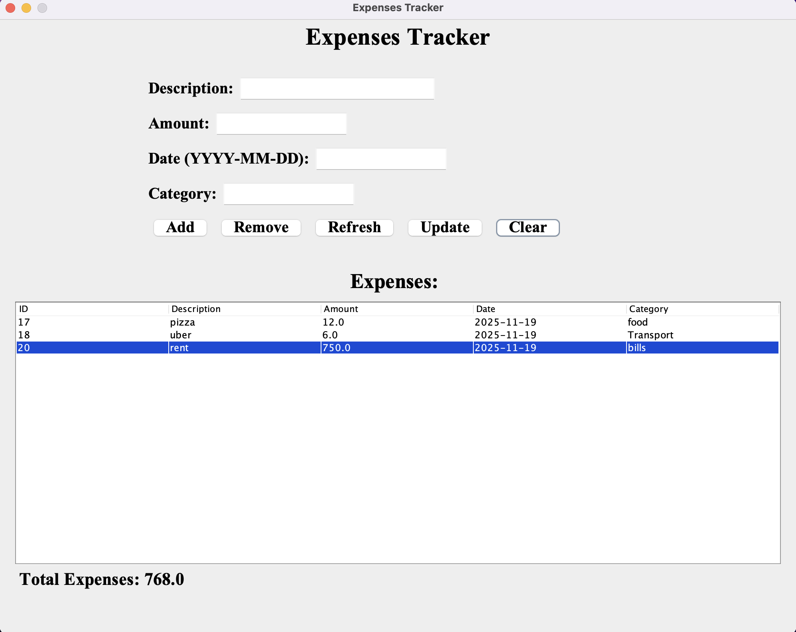
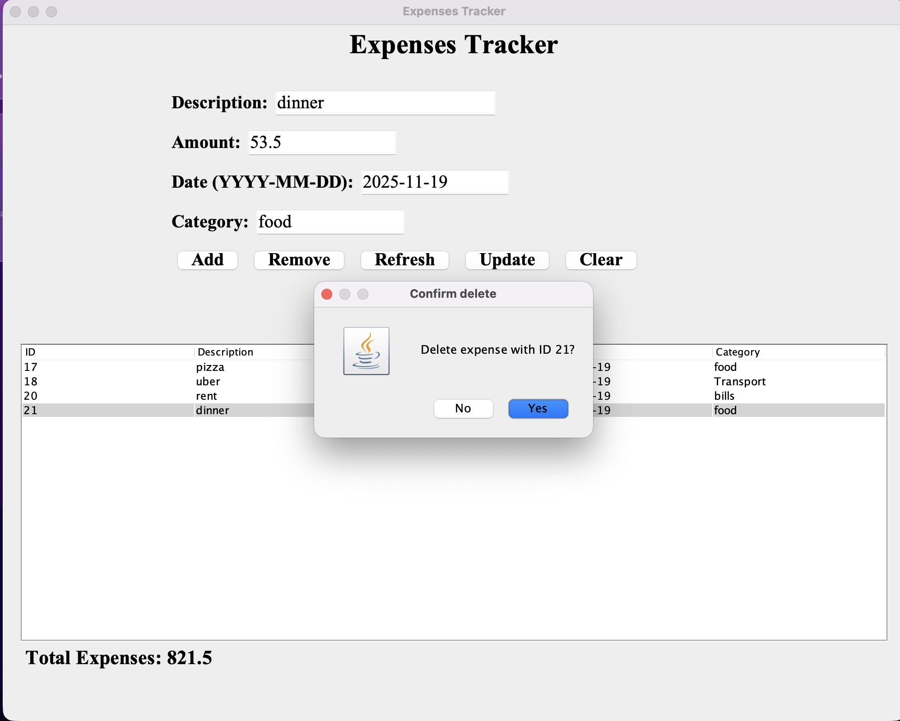

# ExpenseTracker — Java Swing + SQLite

A lightweight desktop application built with **Java Swing** and **SQLite** for managing personal expenses.  
Users can add expenses, edit existing entries, delete rows, and view all records through a simple and clean UI.

---

## 🚀 Features

### ✅ Desktop Application (Java Swing)
- Clean and intuitive user interface  
- Add, edit, and delete expenses  
- Real-time table updates  
- Error handling and validation  
- Organized MVC-like structure  

### ✅ Database (SQLite)
- Local persistent storage using `database.db`  
- Simple JDBC integration  
- Zero configuration — runs out of the box  

---

## 🛠️ Tech Stack

**UI / App Logic:**  
- Java  
- Swing  
- MVC-inspired structure  

**Database:**  
- SQLite  
- JDBC Driver  

---

## 📸 Screenshots

### Main UI  

### Delete Confirmation  

---
